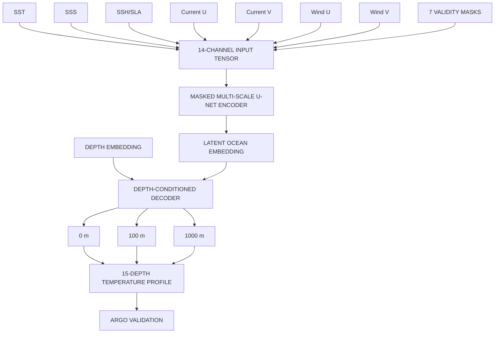

# OCEANEMBED
**SIH 2026 — SIH26066**

**Satellite Embedding-Based Deep Learning Framework for Reconstruction of Subsurface Ocean Temperature**

*Research & Technical Team Dossier*

---

> **"We evaluated the obvious approaches first, identified their limitations for this specific problem, and then designed OceanEmbed around the smallest set of components that can plausibly capture spatial structure, represent the joint surface ocean state, and reconstruct a coherent subsurface temperature profile."**

---

## 1. Executive Summary

OceanEmbed is our team's proposed concrete solution to Smart India Hackathon (SIH) 2026 Problem Statement 26066. The objective is to reconstruct 3D subsurface ocean temperature profiles using only 2D surface observations collected by satellites. 

This document serves as the definitive engineering and research guide for our 6-member team. It establishes our core technical decision, explicitly defining the exact architecture we are building: **Masked Multi-Scale U-Net → Latent Ocean Embedding → Depth-Conditioned Profile Decoder**. It explicitly separates our *target solution* from the *baselines* we use for comparison and the *advanced extensions* (temporal context, uncertainty) we will test. 

## 2. The SIH Problem

**[Official Source: SIH 26066]**

| Requirement | SIH Specification |
| :--- | :--- |
| **Region** | North Indian Ocean (5°N–30°N, 45°E–105°E) |
| **Spatial / Temporal** | 0.25° × 0.25° / Daily |
| **Surface Inputs** | SST, SSS, SSH/SLA, Surface U/V current, Wind U/V |
| **Target Output** | Subsurface temperature |
| **Target Depths** | 0, 5, 10, 20, 30, 50, 75, 100, 125, 150, 200, 300, 500, 700, 1000 m |
| **Training target** | GLORYS Global Ocean Reanalysis |
| **Validation** | Gridded ARGO / INCOIS LAS (Independent) |

## 3. What Exactly Are We Predicting?

OceanEmbed is fundamentally **a high-dimensional spatiotemporal inverse problem**. 

The problem is NOT simply taking 7 numbers and doing a linear regression to 15 numbers. We are predicting a complex spatial field based on an underlying physical structure. 

We must map a 2D surface state to a 3D subsurface volume:
`Spatiotemporal surface field` ➔ `Latent ocean state` ➔ `Vertical temperature profile`

## 4. Why Simple Approaches Are Not Enough

A point-wise model sees only one grid cell. It completely misses eddies, neighboring thermal structures, spatial gradients, current structures, and mesoscale context. The ocean is a fluid dynamics system; treating adjacent 0.25° pixels as entirely independent ignores the fundamental spatial reality of oceanography. 

Similarly, treating the 15 output depths as completely isolated prediction tasks ignores the fact that they represent a single continuous vertical water column. 

## 5. Elimination of Obvious Approaches

Before proposing a custom architecture, we explicitly evaluate and demote approaches that either lack necessary capabilities or introduce unneeded complexity.

1. **Point-wise MLP & Linear Regression:** Treats every grid cell independently. Cannot naturally exploit neighboring structures. *Useful as baselines, not final architectures.*
2. **XGBoost / LightGBM:** Strong tabular benchmarks, but do not naturally model dense spatial fields and neighborhood structures. *Keep as benchmark, not a preferred architecture.*
3. **Plain CNN:** Captures spatial context. Strong candidate baseline, but profile generation/depth structure is not explicitly modeled. *Use as an important baseline.*
4. **Plain U-Net:** Strong multi-scale spatial representation suited to dense geospatial reconstruction. But by itself, it does not explicitly create a compact latent ocean-state representation or a depth-conditioned profile decoder.
5. **ConvLSTM:** Useful for temporal dependencies, and already seen in existing literature. However, it should NOT automatically be chosen as the starting architecture due to compute cost. *Treat temporal modeling as an extension after proving the spatial architecture.*
6. **Pure Transformer / ViT:** Powerful but potentially expensive/data-hungry. Higher implementation complexity makes it sub-optimal for a first-pass student PoC.
7. **Autoencoder Alone:** Compression alone does not solve the supervised subsurface reconstruction problem. 
8. **GNN:** Can model relationships between nodes, but the target is already represented on a regular 0.25° grid. Adds graph-construction and computational complexity without an obvious first-order advantage. *Do not choose it as the initial architecture.*
9. **Giant Hybrid Architecture ("Architecture Soup"):** Explicitly rejected. Complexity must earn its place through measurable improvement.

## 6. Research Landscape

Existing work demonstrates that CNN, ConvLSTM, and Transformer variants can solve this problem. Therefore, our contribution is NOT simply "using deep learning". 

Our proposed contribution is the experimentally validated system design and evaluation of a compact surface-to-profile reconstruction framework centered on a learned latent representation and explicit depth-conditioned decoding, with missing-data handling and independent ARGO validation.

---

## 7. WHAT WE ARE GOING TO BUILD

After evaluating the obvious approaches, our team has selected a concrete target architecture for OceanEmbed:

**Masked Multi-Scale U-Net → Latent Ocean Embedding → Depth-Conditioned Profile Decoder**

This is not a generic deep-learning pipeline. It is the specific system we intend to implement for SIH26066.

**INPUT:**
7 surface variables (SST, SSS, SSH/SLA, Surface U/V, Wind U/V)
PLUS: 7 validity/missing-data masks.
These are harmonized onto the SIH 0.25° × 0.25° daily grid.
The resulting input is effectively: `X ∈ R^(14 × H × W)`

### STAGE 1 — MASKED MULTI-SCALE U-NET
The 14-channel input tensor goes into a U-Net-style encoder. Its purpose is NOT simply "feature extraction". Its purpose is to learn spatial ocean structures relevant to subsurface temperature: local SST gradients, fronts, SSH gradients, current structures, mesoscale/eddy patterns, and relationships among variables. The model uses the validity masks so that missing observations (e.g. from clouds) are distinguished from real numerical zero values.

### STAGE 2 — LATENT OCEAN EMBEDDING
This is the CORE IDEA behind the name OceanEmbed. The deepest/bottleneck representation of the U-Net becomes a compact learned representation of the joint surface ocean state. The seven surface variables do not independently determine the subsurface temperature; they collectively contain information about the ocean's surface state. 

*Note: This is a latent representation of the observed surface ocean state, NOT the "true physical state of the ocean".*

### STAGE 3 — DEPTH-CONDITIONED PROFILE DECODER
The latent Ocean Embedding is not directly converted into 15 unrelated output neurons. Instead, the decoder is explicitly conditioned on depth.
For each requested depth *z* (0, 5, 10... 1000m), the model combines:
`Latent Ocean Embedding + Depth Representation`
and predicts:
`T(z) = Decoder(OceanEmbedding, DepthEmbedding(z))`

The decoder is queried for all 15 SIH depths. Depth conditioning allows the decoder to explicitly know: *"What depth am I predicting?"*. The 15 outputs belong to the SAME vertical temperature profile; they are measurements along the same vertical ocean structure. 

*(We hypothesize that explicit depth conditioning will provide a better representation of the vertical profile structure; this must be demonstrated through ablation experiments.)*

### STAGE 4 — PROFILE OUTPUT
The final output is a 3D temperature field (Latitude × Longitude × Depth) for each day. The model is NOT producing one temperature number; it is producing a subsurface vertical temperature profile at every grid cell.

---

## 8. OceanEmbed Architecture



---

## 9. How the OceanEmbed Model Works

1. At a given day, the model receives seven surface fields.
2. Each field is aligned to the same 0.25° NIO grid.
3. A validity mask accompanies each field.
4. The 14-channel tensor is passed through the U-Net encoder.
5. Convolutional layers capture local and regional spatial patterns.
6. The bottleneck compresses the information into a latent Ocean Embedding.
7. A depth representation is created for each requested SIH depth.
8. The latent embedding and depth representation are passed to the profile decoder.
9. The decoder predicts temperature for that depth.
10. The process produces the 15-depth temperature profile.
11. Predictions are compared against GLORYS during training/testing.
12. Final independent performance is evaluated against ARGO.

## 10. Why Each Component Exists

- **The problem is spatial** → use U-Net.
- **The input consists of multiple coupled surface variables** → learn a joint latent representation.
- **The target is a vertical profile** → condition the decoder on depth.
- **Satellite data can be incomplete** → explicitly provide validity masks.
- **The team has limited compute** → start with a compact CNN/U-Net instead of a huge Transformer.
- **Temporal dynamics may matter** → test them as an extension rather than assuming they are necessary.
- **Scientific credibility requires independent validation** → use ARGO.
- **Every additional component must demonstrate measurable benefit.**

This gives us a concrete architecture without creating unnecessary architecture complexity.

---

## 11. Data Pipeline

1. **Acquisition**: Obtain 7 surface variables, GLORYS subsurface temperature, and ARGO observations.
2. **Spatial harmonization**: Define NIO region. Convert/regrid all datasets to 0.25° × 0.25°. Ensure consistent conventions.
3. **Temporal harmonization**: Convert data to daily aligned samples. Document interpolation decisions.
4. **Quality control**: Detect invalid values. Preserve masks. Do NOT blindly fill missing values without recording validity.

## 12. GLORYS Target Construction

Create 15-depth GLORYS temperature targets. If GLORYS native vertical levels do not exactly match SIH depths, we will retain native levels sufficient to cover 1000 m and interpolate locally to the required 15 depths. *NEVER interpolate a surface-only temperature field down to 1000 m.*

## 13. Training Pipeline

- Fit normalization statistics ONLY on training data.
- Apply the same transformation to validation/test data.
- Train baselines (MLP, CNN).
- Train the Proposed Model (OceanEmbed).

## 14. ARGO Independent Validation

Match predictions to ARGO observations using spatial colocation tolerance, temporal colocation tolerance, and depth interpolation. Do NOT require exact grid/date matching. Evaluate RMSE, correlation, bias, and depth-wise performance. 

## 15. Experimental Baselines

We explicitly separate our target solution from the baselines we compare it against:
- Climatology / persistence
- Linear / statistical baseline
- Point-wise MLP
- XGBoost / LightGBM (if feasible)
- Plain CNN
- Plain U-Net

## 16. Ablation Strategy

| Model | Spatial Context | Latent Embedding | Depth Conditioning | Temporal Context | Purpose |
| :--- | :--- | :--- | :--- | :--- | :--- |
| **MLP** | No | No | No | No | Point-wise Baseline |
| **CNN** | Yes | No | No | No | Spatial Baseline |
| **U-Net** | Yes | No | No | No | Multi-scale Baseline |
| **U-Net + Embedding** | Yes | Yes | No | No | Test Embedding |
| **OceanEmbed (Core)** | Yes | Yes | Yes | No | **Target Solution** |
| **Full + Temporal** | Yes | Yes | Yes | Yes | Test Extension |

*Decision Logic:* If the latent embedding does not improve performance, we remove it. If depth conditioning does not improve performance, we reconsider it. If temporal context does not improve enough to justify complexity, we do not use it.

---

## 17. Core MVP vs Advanced Extensions

**OceanEmbed MVP (CORE OCEANEMBED - BUILD THIS FIRST)**
- INPUT: 7 surface variables + 7 validity masks
- PROCESSING: daily harmonization, 0.25° regridding, QC, normalization, masked multi-scale U-Net
- REPRESENTATION: Latent Ocean Embedding
- DECODER: Depth-Conditioned Profile Decoder
- OUTPUT: 15-depth subsurface temperature profile
- VALIDATION: GLORYS reference evaluation, independent ARGO validation

**OPTIONAL EXTENSION 1 — TEMPORAL CONTEXT**
After the spatial model works, test whether adding 3–7 days of historical surface information improves performance (e.g., temporal convolution, ConvGRU, lightweight attention). *Do NOT put ConvLSTM in the core architecture from day one.*

**OPTIONAL EXTENSION 2 — UNCERTAINTY**
After deterministic reconstruction works, investigate MC Dropout, Deep Ensembles, or probabilistic regression to estimate confidence in predictions, especially at deeper levels.

**OPTIONAL EXTENSION 3 — PHYSICS**
Do NOT impose a simplistic monotonic temperature-with-depth constraint. Any physics-aware loss must be scientifically justified and experimentally tested.

---

## 18. Feasibility for Six Students

- **Data feasibility:** GLORYS is available. SIH requires a manageable NIO subset. Start with a 7-day / 1-month pilot. Scale only after successful audit.
- **Compute feasibility:** 0.25° NIO grid is dramatically smaller than the full global native GLORYS grid. Train on spatial patches/batches. Use mixed precision if GPU supports it. Start with a compact U-Net. Do not begin with a giant Transformer.
- **Engineering feasibility:** Achievable using PyTorch, xarray, netCDF, NumPy, and reproducible preprocessing scripts.
- **Team feasibility:** Assign specific, dependent roles.

## 19. Implementation Plan

| Member | Responsibilities | Dependencies |
| :--- | :--- | :--- |
| **1** | Data acquisition + preprocessing | Unblocks Member 2 & 3 |
| **2** | GLORYS target + vertical interpolation | Depends on Member 1 |
| **3** | Baselines | Depends on Member 2 |
| **4** | U-Net + embedding + decoder | Depends on Member 3 |
| **5** | ARGO validation + metrics | Independent until inference |
| **6** | Integration + experiments + documentation | Integrates 4 & 5 |

## 20. Go / No-Go Gates

- **GATE 1:** Can we obtain valid 3D GLORYS data covering 0–1000+ m? *(If NO: Do not proceed with fake/interpolated targets).*
- **GATE 2:** Can the data pipeline produce valid 0.25° daily NIO samples? *(If NO: Fix pipeline before modeling).*
- **GATE 3:** Does U-Net outperform point-wise baselines? *(If NO: Reconsider spatial architecture).*
- **GATE 4:** Does latent embedding improve reproducibly? *(If NO: Remove it).*
- **GATE 5:** Does depth conditioning improve profile reconstruction? *(If NO: Do not force it).*
- **GATE 6:** Does temporal modeling improve independent validation enough to justify complexity? *(If NO: Do not include it).*
- **GATE 7:** Does the final system improve against independent ARGO validation? *(If NO: Do not claim success).*

## 21. Scientific Risks and Guardrails

- **Data Leakage:** Use chronological splitting. Prevent spatial patch overlap leakage and normalization leakage. ARGO MUST remain independent.
- **GLORYS is not Ground Truth:** GLORYS is a training/reference target. ARGO is validation.
- **Physics Guardrails:** Temperature does not strictly decrease monotonically with depth due to salinity factors and barrier-layer effects. Avoid fake "physics-informed AI" claims.

---

## 22. Judge Explanation

**IF A JUDGE ASKS: "WHAT EXACTLY IS YOUR SOLUTION?"**
*"Our solution is OceanEmbed, a masked multi-scale U-Net that converts the seven required surface ocean variables into a learned latent Ocean Embedding. We then combine that embedding with a depth representation in a depth-conditioned decoder to reconstruct temperature at the 15 SIH-required depths. So instead of independently predicting subsurface temperatures from individual surface pixels, we first understand the spatial surface state and then decode it into a vertical temperature profile. We train against GLORYS and independently validate the reconstruction against ARGO."*

**20-Second Version:**
*"Seven surface variables plus masks go into a multi-scale U-Net. Its bottleneck becomes our learned Ocean Embedding. A depth-conditioned decoder converts that embedding into temperatures at 15 depths from the surface to 1000 metres. We then validate the resulting 3D reconstruction independently against ARGO."*

---

## 23. Final Team Decision

```text
╔════════════════════════════════════════════╗
║        OUR OCEANEMBED SOLUTION             ║
╠════════════════════════════════════════════╣
║ INPUT                                      ║
║ 7 surface variables + 7 validity masks     ║
║                                            ║
║ ENCODER                                    ║
║ Masked Multi-Scale U-Net                   ║
║                                            ║
║ REPRESENTATION                             ║
║ Latent Ocean Embedding                     ║
║                                            ║
║ DECODER                                    ║
║ Depth-Conditioned Profile Decoder          ║
║                                            ║
║ OUTPUT                                     ║
║ 15-depth temperature profile               ║
║ 0 → 1000 m                                 ║
║                                            ║
║ VALIDATION                                 ║
║ GLORYS → training/reference                ║
║ ARGO → independent validation              ║
╚════════════════════════════════════════════╝
```

*Everything else — temporal modeling, attention, uncertainty and physics-aware losses — is an extension that must earn its place through experiments.*

---

## 24. References

1. **[Official Source]** Smart India Hackathon 2026 Problem Statement 26066.
2. **[Official Source]** Copernicus Marine Service. *Global Ocean Physics Multiyear Product*. Dataset: `cmems_mod_glo_phy_my_0.083deg_P1D-m`. 
3. **[Official Source]** GLORYS12V1 Reference. DOI: [https://doi.org/10.48670/moi-00021](https://doi.org/10.48670/moi-00021)
4. **[Official Source]** ARGO Data Management. Gridded ARGO / INCOIS LAS. 
*(Additional peer-reviewed literature citations pending formal literature review completion).*
