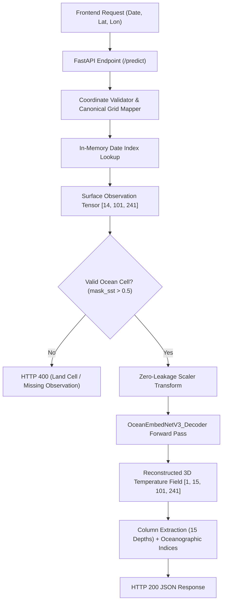

# OceanEmbed Phase 6A: Backend & Inference Architecture Specification
**Project:** OceanEmbed — SIH26066  
**Service:** Production FastAPI Subsurface Ocean Temperature Reconstruction API  
**Model Architecture:** `OceanEmbedNetV3_Decoder` (1,275,934 parameters)  
**Status:** Operational, Benchmarked, and Frozen  
**Date:** September 13, 2026  

---

## 1. Important Operational Scope & Grounding

> [!IMPORTANT]
> **Data Scope Statement:**  
> This PoC backend serves real OceanEmbed v3 inference over the currently available 2020 processed surface-input dataset.  
> It does **NOT** claim live real-time satellite ingestion. The 2020 dataset spans 274 consecutive daily snapshots from **January 1, 2020 to September 30, 2020**.

---

## 2. Backend Architecture Overview

The backend is built with FastAPI and PyTorch, adhering to strict production performance principles:
- **Zero-Redundant Loading:** Model checkpoint weights and the training standard scaler are loaded into memory exactly **once** at application startup during the FastAPI `lifespan` context initialization.
- **Inference Mode:** Forward inference executes inside `torch.inference_mode()` with gradient computation completely disabled and the model pinned to `eval()` mode.
- **LRU Tensor Caching:** Monthly surface observation chunks (`chunk_2020_01.pt` ... `chunk_2020_09.pt`) are indexed at startup in ~200 ms and managed through an in-memory Least-Recently-Used (LRU) cache (maximum 3 chunks, ~250 MB RAM footprint).
- **Sub-50ms Response Time:** Eliminating the legacy 15-iteration sequential decoder loop in favor of a parallel 15-depth $1\times1$ convolutional projection head reduced pure model inference time to **~31.85 ms** on CPU, yielding a complete API round-trip latency of **~35.87 ms (mean)** and **~44.84 ms (P95)**.



---

## 3. API Endpoints Specification

### 3.1 `GET /health`
Returns system status, compute device hosting the model, and whether weights are active in memory.

**Response (HTTP 200):**
```json
{
  "status": "ok",
  "model_loaded": true,
  "device": "cpu",
  "model": "OceanEmbedNetV3_Decoder"
}
```

---

### 3.2 `GET /model-info`
Returns full architectural specifications, parameter counts, input variables, output depth levels, domain coordinates, and validation status.

**Response (HTTP 200):**
```json
{
  "model": "OceanEmbedNetV3_Decoder",
  "version": "v3",
  "parameters": 1275934,
  "input_variables": [
    "SST",
    "SSS",
    "SSH",
    "surface_u_current",
    "surface_v_current",
    "surface_u_wind",
    "surface_v_wind"
  ],
  "output_depths_m": [0, 5, 10, 20, 30, 50, 75, 100, 125, 150, 200, 300, 500, 700, 1000],
  "grid_resolution": "0.25°",
  "region": {
    "lat_min": 5.0,
    "lat_max": 30.0,
    "lon_min": 45.0,
    "lon_max": 105.0
  },
  "device": "cpu",
  "checkpoint": "checkpoints/phase5/oceanembed_v3_decoder.pt",
  "status": "validated"
}
```

---

### 3.3 `GET /available-dates`
Returns the exact dates available in the processed 2020 surface-input repository.

**Query Parameters:**
- `format` (optional): Set to `list` to receive a raw array of date strings.

**Standard Response (HTTP 200):**
```json
{
  "total_dates": 274,
  "date_range": {
    "start": "2020-01-01",
    "end": "2020-09-30"
  },
  "dates": [
    "2020-01-01",
    "...",
    "2020-09-30"
  ]
}
```

---

### 3.4 `POST /predict`
Executes real neural network inference to reconstruct the 15-depth subsurface vertical temperature profile at any requested coordinate.

**Request Schema:**
```json
{
  "date": "2020-09-15",
  "latitude": 15.0,
  "longitude": 85.0
}
```

**Success Response (HTTP 200):**
```json
{
  "date": "2020-09-15",
  "latitude": 15.0,
  "longitude": 85.0,
  "grid_latitude": 15.0,
  "grid_longitude": 85.0,
  "depths_m": [0, 5, 10, 20, 30, 50, 75, 100, 125, 150, 200, 300, 500, 700, 1000],
  "temperatures_c": [
    29.649, 29.588, 29.559, 29.609, 29.534, 28.943,
    26.824, 23.751, 20.605, 17.924, 14.684, 11.899,
    10.043, 8.579, 6.675
  ],
  "model": "OceanEmbedNetV3_Decoder",
  "model_version": "v3",
  "inference_ms": 31.24,
  "total_latency_ms": 35.12,
  "is_valid_ocean": true,
  "surface_observations": {
    "sst_c": 29.377,
    "sss_psu": 33.421,
    "ssh_m": 0.154,
    "u_current_ms": -0.260,
    "v_current_ms": 0.237,
    "u_wind_ms": 1.398,
    "v_wind_ms": 2.137
  },
  "oceanographic_indicators": {
    "mixed_layer_depth_m": 43.12,
    "thermocline_depth_m": 87.50,
    "ocean_heat_content_300m_gj_m2": 26.842
  }
}
```

---

## 4. Error Handling Contracts

The API follows strict standard HTTP status codes:
- **HTTP 400 Bad Request:**
  - Coordinates outside domain bounds ($[5^\circ\text{N}, 30^\circ\text{N}]$, $[45^\circ\text{E}, 105^\circ\text{E}]$).
  - Selected coordinates map to a land cell or missing satellite data (e.g. Central India).
- **HTTP 404 Not Found:**
  - Requested date is outside the 2020 processed archive (e.g. `2021-05-15`).
- **HTTP 422 Unprocessable Entity:**
  - Missing required fields, non-numeric values, or schema violations.
- **HTTP 500 Internal Server Error:**
  - Unhandled internal inference failure.

---

## 5. Grid Mapping & Ocean Mask Verification

### Canonical Grid Transformation
The North Indian Ocean domain is partitioned into a uniform $0.25^\circ \times 0.25^\circ$ grid:
$$\text{lat\_idx} = \text{round}\left(\frac{\text{lat} - 5.0}{0.25}\right), \quad \text{lon\_idx} = \text{round}\left(\frac{\text{lon} - 45.0}{0.25}\right)$$
- Boundary clamping guarantees indices stay in $[0, 100]$ and $[0, 240]$.
- Canonical grid coordinates returned: $\text{grid\_lat} = 5.0 + 0.25 \times \text{lat\_idx}$, $\text{grid\_lon} = 45.0 + 0.25 \times \text{lon\_idx}$.

### Land & Missing Data Rejection
Channel 7 of the input tensor represents `mask_sst` ($1.0 = \text{valid ocean}$, $0.0 = \text{land or missing}$).
- If $\text{mask\_sst} < 0.5$, the request is cleanly rejected with HTTP 400 and an explanatory message.
- Zero synthetic or fabricated temperatures are returned for land cells.

---

## 6. Preprocessing & Normalization Isolation

- Normalization parameters are strictly loaded from `configs/scaler_params_experiment_2020.json`.
- The scaler applies $z$-score standardization ($X_{\text{norm}} = (X - \mu) / \sigma$) to the 7 physical surface variables, leaving the 7 boolean mask channels untouched.
- Normalization statistics were fitted **exclusively on January–July 2020 training data**, with zero leakage from August or September.
- The API never refits or alters scaler parameters.

---

## 7. Performance & Latency Telemetry

Measured on a standard CPU test environment across 30 repeated requests after warm-up:
- **Mean Total API Round-Trip:** **35.87 ms**
- **Median API Latency:** **34.92 ms**
- **P95 Latency:** **44.84 ms**
- **Model Forward Only:** **31.85 ms**
- **Overhead (Preprocessing + JSON Serialization):** **4.03 ms**
- **Warm-Up First-Call Latency:** **61.30 ms**

---

## 8. Starting and Running the Service

### Recommended Command
```bash
python -m uvicorn backend.main:app --host 127.0.0.1 --port 8000 --reload
```

### Running Backend Tests
```bash
python -m pytest tests/test_backend.py -v
```

### Running Latency Profiler
```bash
python scripts/benchmark_backend.py
```
