# OceanEmbed Phase 6C: Frontend Scientific & Demo Hardening Specification
**Project:** OceanEmbed — SIH26066  
**Module:** Research Prototype User Interface (React + TypeScript + Vite)  
**Model Architecture:** `OceanEmbedNetV3_Decoder` (1,275,934 parameters)  
**Status:** Frozen for SIH Presentation & Demonstration  
**Date:** September 13, 2026  

---

## 1. Executive Summary & Design Standards

Phase 6C performs the final scientific accuracy, claim discipline, demo reliability, and visual polish pass on the OceanEmbed user interface.

### 1.1 Strict Scientific Design Standards
- **Academic Light Theme:** Clean off-white background (`bg-slate-100`), crisp white analytical cards (`bg-white`), dark charcoal text (`text-slate-900` / `text-slate-700`), ocean blue primary (`#0369a1` / `text-sky-800`), and warm amber thermocline accents.
- **No Marketing Fluff:** Zero generic AI tropes—no purple/neon glowing gradients, no floating particles, no fake 3D wireframe waves, and no hyperbolic marketing buzzwords.
- **Zero Mock Data:** Fully integrated with the live FastAPI backend (`http://127.0.0.1:8000`). All predictions are real neural network inferences.

---

## 2. Component Hierarchy & System Architecture

```mermaid
graph TD
    App["src/App.tsx (Root State & Jury Demo Controller)"]
    App --> Header["Header.tsx (Live Health Polling & SIH Badge)"]
    App --> Hero["Hero.tsx (Domain & Cadence Specification Strip)"]
    App --> Workspace["Interactive Reconstruction Workspace (12-Col Grid)"]
    
    subgraph "Left Column (5 Cols)"
        Workspace --> ControlPanel["ControlPanel.tsx (Coords, Date Picker, Predict CTA)"]
        Workspace --> OceanMap["OceanMap.tsx (Zero-Dep SVG Map + Presets)"]
    end
    
    subgraph "Right Column (7 Cols)"
        Workspace --> ProfileChart["ProfileChart.tsx (Inverted Non-linear SVG Profile)"]
        Workspace --> DepthInspector["DepthInspector.tsx (15 Depth Quick-Select Pills)"]
        Workspace --> ProfileMetrics["ProfileMetrics.tsx (Strata, MLD, Thermocline, OHC)"]
        Workspace --> SurfaceObs["SurfaceObservationsPanel.tsx (7 Satellite Fields)"]
    end
    
    App --> ModelPerf["ModelPerformance.tsx (Audited GLORYS & ARGO Benchmarks)"]
    App --> Methodology["Methodology.tsx (Verified 4-Stage Architecture Pipeline)"]
    App --> Limitations["Limitations.tsx (Scope & Scientific Limitations)"]
    App --> Footer["Footer.tsx (SIH26066 Metadata & Checkpoint Specifications)"]
    
    App -.-> API["src/services/api.ts (HTTP Client)"]
    API <==> Backend["FastAPI Backend (http://127.0.0.1:8000)"]
```



---

## 3. Scientific Terminology & Claim Discipline

### 3.1 GLORYS Ground Truth Elimination
- In compliance with scientific discipline, GLORYS is strictly documented as the **"GLORYS Global Ocean Reanalysis reference"** or **"reanalysis training/reference target"**.
- GLORYS is never described as "observational ground truth", "direct measurement", or "sensor truth", preserving strict scientific distinction between data-assimilated numerical model output and in-situ sensor telemetry.

### 3.2 ARGO Observational Check Phrasing
- Approved wording is used exclusively:
  > *"Independent observational check using 497 matched profile-depth observations from 36 ARGO profiles across 28 unique WMO floats in September 2020."*
- Short form when space is constrained: *"497 matched profile-depth observations"*.
- Never claims "497 independent observations" or implies full statistical independence across depths of the same profile.
- Clarifies temporal sampling: *"Selected September 2020 ARGO snapshots"* (September 1, 15, and 25 snapshots).

### 3.3 Depth Terminology
- Grouping:
  - Surface: 0, 5, 10, 20, 30, 50m
  - Thermocline region: 75, 100, 125, 150m
  - Intermediate: 200, 300m
  - Deep: 500, 700, 1000m
- "Abyssal" has been completely removed and replaced with "Deep" or "Deep Ocean".

### 3.4 Elimination of Unsupported Physics Claims
- Removed all unsupported claims attributing specific physical mechanisms to the latent representations (e.g., "hidden vertical mixing physics", "wind-stress curl coupling", "thermocline depth sensitivity", "non-linear manifold projection").
- Replaced with technically conservative, factual descriptions:
  *"learns a compact representation of spatial and cross-variable surface-state patterns"* and *"maps the learned representation to temperature at 15 standard depths."*
- Removed any claim of "Monotonicity & Inversion Checked" since ocean columns can contain physical temperature inversions.

---

## 4. Architectural Verification & Conceptual Pipeline

The methodology communicates the exact conceptual pipeline:
```
7 Surface Variables + 7 Validity Masks (14 Channels)
                   ↓
      Multi-scale Spatial Encoder
                   ↓
         Ocean Latent Embedding
                   ↓
   Parallel Multi-depth Projection Head
                   ↓
     15-depth Temperature Profile
```

### 4.1 Engineering Speedup (7.2×)
- Documented purely as an engineering milestone:
  > *"Replacing the sequential single-channel shared decoder loop with a parallel multi-depth projection head accelerated epoch training time from approximately 172 seconds to approximately 24 seconds per epoch under identical conditions."*
- Excluded speculative claims such as "gradient vanishing was eliminated".

---

## 5. Demonstration Workflow & Error Handling

1. **Jury Demo Initial State:**
   - Default coordinates: 15.00°N, 85.00°E (Central Bay of Bengal).
   - Default date: 2020-09-15 (Held-out benchmark date).
   - No pre-rendered fake profile; displays a clear ready prompt with CTA "Reconstruct Temperature".
2. **Live Execution:**
   - Clicking CTA initiates real `POST /predict`.
   - Displays loading spinner.
   - Renders the returned profile, 7 surface observations, and profile-derived indicators (MLD, Thermocline depth, OHC300).
3. **Error Handling & Stale Data Prevention:**
   - Selecting a land coordinate (e.g., Central India) triggers an HTTP 400 rejection from the backend.
   - The frontend clears stale prediction profiles and presents a non-blocking diagnostic notice explaining that the selected grid cell is on land or has invalid satellite observations.

---

## 6. Build and Verification Sign-Off

```
vite v6.4.3 building for production...
transforming...
✓ 1686 modules transformed.
rendering chunks...
computing gzip size...
dist/index.html                   1.10 kB │ gzip:  0.50 kB
dist/assets/index-CW0PwIJd.css   30.48 kB │ gzip:  6.40 kB
dist/assets/index-CKPWVduv.js   267.78 kB │ gzip: 76.96 kB
✓ built in 3.09s
```

All 19 Python backend and end-to-end integration tests pass (`pytest tests/test_backend.py tests/test_e2e.py` 19/19 passed in 5.89s).
